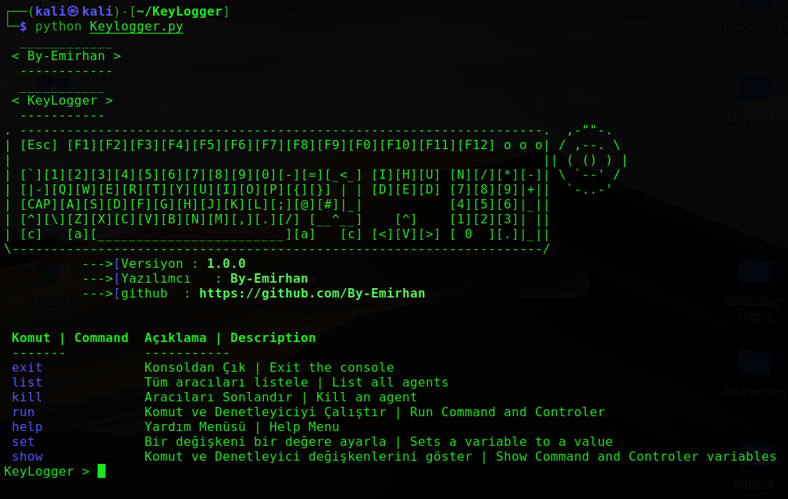

# By-Emirhan
# KeyLogger

# Hangi Sistemlerde Çalışır? | On Which Systems Does It Work?
* `KALİ LİNUX`
* `UBUNTU`
* `PARDUS`
* `MİNT`
* `TERMUX`
* `ARCH`
# YÜKLEME & ÇALIŞTIRMA KOMUTLARI | LOAD & RUN COMMANDS
  
* `apt-get install python -y | apt-get install python2 -y`
* `https://github.com/By-Emirhan/KeyLogger.git`  
* `cd KeyLogger`

##### Çalıştırmak İçin >>> `python KeyLogger.py`
##### Termux İçin >>> `python2 KeyLogger.py`

<h3 align="center">
:: Ekran Görüntüsü ::

  

